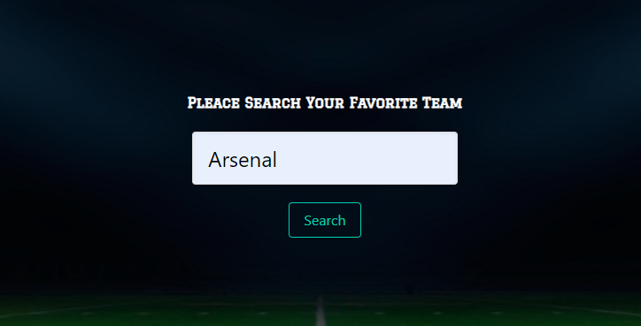

## Project BALL FINDER

<!-- PROJECT LOGO -->
 

  

  <h3 align="center">Ball Finder</h3>

  

    An awesome Website to search up coming events
     
    <a href="https://ayadalshaikhli.github.io/apiproject/"><strong>Explore the Website »</strong></a>
     
  

<!-- TABLE OF CONTENTS -->

  
Table of Contents

  <ol>
    <li>
      <a href="#about-the-project">About The Project</a>
      <ul>
        <li><a href="#built-with">Built With</a></li>
      </ul>
    </li>
    <li><a href="#usage">Usage</a></li>
    <li><a href="#contact">Contact</a></li>
    <li><a href="#acknowledgements">Acknowledgements</a></li>
  </ol>

<!-- ABOUT THE PROJECT -->

## About The Project

The Ball Finder is a web app that enables you to search for your favoirot team up coming event, and view what

### Built With

- [JavaScript](https://www.javascript.com/)
- [HTML](https://html.com/)
- [CSS](https://www.google.com/)
- [Bulma](https://bulma.io/)
- [MapBox](https://www.mapbox.com/)
- [thesportApi](https://www.thesportsdb.com/)

## Usage

You can easly use this website by searching your favoirte team name 
_For more examples, please refer to the [Documentation](https://example.com)_
